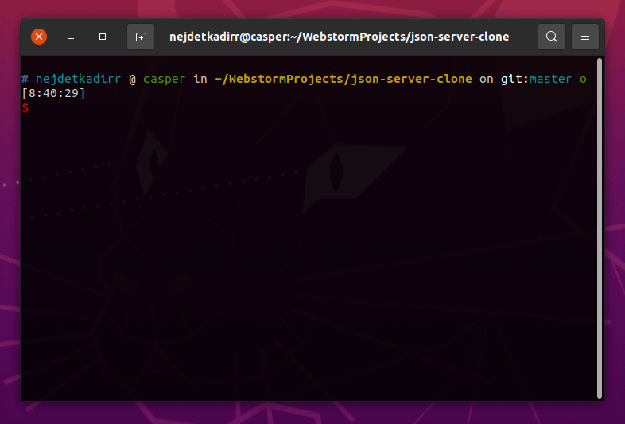

# JSON SERVER
Create a server and serve content of your json files in localhost


# Usage
You can use this command for just serve files with your specific port. You can use without port with this command. Port will be default defined as 5555
```sh
$ node index.js <file path> --port=<port>
```
Output:
```sh
[
  { file: '<filename>', url: 'http://localhost:<port>/<filename>' },
  port: <port>,
  base_url: 'http://localhost:<port>',
  server_status: 'online'
]
```

If you want to create REST API with zero coding, you can use watch command. Watch command supports only one file but supports specific port 
```sh
$ node index.js --watch <file path> --port=<port>
```
Output:
```sh
[
  {
    description: 'List all <table name> as JSON',
    url: 'http://localhost:<port>/<table name>'
  },
  {
    description: 'Get single <table name> with id as JSON',
    url: 'http://localhost:<port>/<table name>/:id'
  },
  data_table: '<table name>',
  port: <port>,
  base_url: 'http://localhost:<port>',
  server_status: 'online'
]
```

# Examples
You can use without port with this command
```sh
$ node index.js api/data.json
```

Output: 
```sh
[
  { file: 'data.json', url: 'http://localhost:5555/data' },
  port: 5555,
  base_url: 'http://localhost:5555',
  server_status: 'online'
]
```

You can serve multiple JSON files with this command
```sh
$ node index.js api/foo.json api/bar.json
```

Output:
```sh
[
  { file: 'foo.json', url: 'http://localhost:5555/foo' },
  { file: 'bar.json', url: 'http://localhost:5555/bar' },
  port: 5555,
  base_url: 'http://localhost:5555',
  server_status: 'online'
]
```

You can serve JSON file like REST API with watch command. 
```sh
½ node index.js --watch api/foo.json
```
Output:
```sh
[
  {
    description: 'List all posts as JSON',
    url: 'http://localhost:5555/posts'
  },
  {
    description: 'Get single post with id as JSON',
    url: 'http://localhost:5555/posts/:id'
  },
  data_table: 'posts',
  port: 5555,
  base_url: 'http://localhost:5555',
  server_status: 'online'
]
```

# LICENSE
```
MIT License

Copyright (c) 2021 Nejdet Kadir Bektaş

Permission is hereby granted, free of charge, to any person obtaining a copy
of this software and associated documentation files (the "Software"), to deal
in the Software without restriction, including without limitation the rights
to use, copy, modify, merge, publish, distribute, sublicense, and/or sell
copies of the Software, and to permit persons to whom the Software is
furnished to do so, subject to the following conditions:

The above copyright notice and this permission notice shall be included in all
copies or substantial portions of the Software.

THE SOFTWARE IS PROVIDED "AS IS", WITHOUT WARRANTY OF ANY KIND, EXPRESS OR
IMPLIED, INCLUDING BUT NOT LIMITED TO THE WARRANTIES OF MERCHANTABILITY,
FITNESS FOR A PARTICULAR PURPOSE AND NONINFRINGEMENT. IN NO EVENT SHALL THE
AUTHORS OR COPYRIGHT HOLDERS BE LIABLE FOR ANY CLAIM, DAMAGES OR OTHER
LIABILITY, WHETHER IN AN ACTION OF CONTRACT, TORT OR OTHERWISE, ARISING FROM,
OUT OF OR IN CONNECTION WITH THE SOFTWARE OR THE USE OR OTHER DEALINGS IN THE
SOFTWARE.

```
